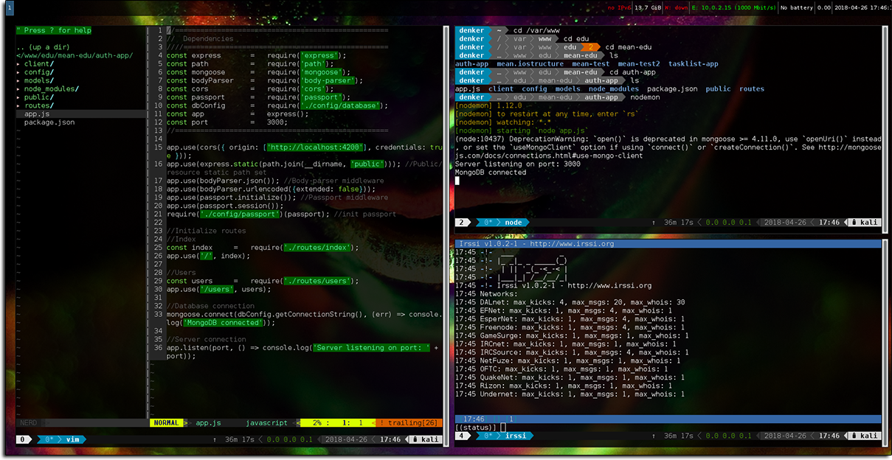

# i3 Config



### Prerequisites
- [i3 wm](https://i3wm.org/)
- [i3-gaps](https://github.com/Airblader/i3)

### Installation
Clone the project repository
```
git clone https://github.com/kyleruss/i3-conf.git
```

Copy the config file into your i3 config directory
```
cp config/i3/config ~/.config/i3/
```

### License
This project is available under the MIT License  
See [LICENSE](LICENSE) for more details
